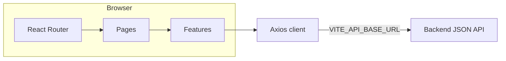

# Auto Dealer System — Frontend

[](LICENSE)

Single-page application for an auto dealership platform: public catalog (models, vehicles, dealerships), authenticated customer account flows (orders, favorites, test drives, custom orders), and staff-only administration views. The UI talks to a **REST JSON API** whose paths are centralized in [`src/services/api/endpoints.js`](src/services/api/endpoints.js). This repository contains **frontend code only**; you need a compatible backend (or mock) at the configured API base URL.

---

## Table of contents

- [Features](#features)
- [Tech stack](#tech-stack)
- [Prerequisites](#prerequisites)
- [Getting started](#getting-started)
- [Environment variables](#environment-variables)
- [NPM scripts](#npm-scripts)
- [Architecture](#architecture)
- [Routing map](#routing-map)
- [Authentication and authorization](#authentication-and-authorization)
- [API integration](#api-integration)
- [Production build](#production-build)
- [Docker](#docker)
- [Testing and code quality](#testing-and-code-quality)
- [Path aliases](#path-aliases)
- [Troubleshooting](#troubleshooting)
- [Contributing](#contributing)
- [License](#license)

---

## Features

### Public (unauthenticated)

- **Home** — Landing content and promotional sections (`LandingLayout`).
- **Vehicles** — List and detail pages (`/vehicles`, `/vehicles/:id`).
- **Models** — List and detail pages (`/models`, `/models/:id`).
- **Dealerships** — List and detail pages (`/dealerships`, `/dealerships/:id`).
- **Company** — Information page under `/company` (`ContentLayout`).
- **Auth** — Sign-in and registration (`/login`, `/register`).

### Customer (authenticated)

Routes under `/account` are wrapped with [`ProtectedRoute`](src/components/routing/ProtectedRoute.jsx). Unauthenticated users are redirected to `/login` with return location preserved.

- **Account overview** — `/account`
- **Orders** — `/account/orders`
- **Favorites** — `/account/favorites`
- **Test drives** — `/account/test-drives`
- **Custom orders** — `/account/custom-orders`

Navigation helpers live in [`src/constants/routes.js`](src/constants/routes.js).

### Staff

Staff routes require an authenticated user whose role passes [`canAccessStaff`](src/constants/roles.js) (`employee` or `admin`). Others are sent to `/forbidden`.

- **Users** — `/staff/users`
- **Orders** — `/staff/orders`
- **Logs** — `/staff/logs`

---

## Tech stack

| Area | Choice |
|------|--------|
| UI | [React 19](https://react.dev/), [React Router 7](https://reactrouter.com/) |
| Build | [Vite 8](https://vite.dev/), [@vitejs/plugin-react](https://github.com/vitejs/vite-plugin-react) |
| Styling | [Tailwind CSS 4](https://tailwindcss.com/) via [`@tailwindcss/vite`](https://tailwindcss.com/docs/installation/using-vite) |
| Fonts | [@fontsource/inter](https://fontsource.org/fonts/inter) |
| Server state | [TanStack Query v5](https://tanstack.com/query) |
| Client state | [Zustand](https://zustand-demo.pmnd.rs/) |
| HTTP | [Axios](https://axios-http.com/) |
| Forms & validation | [React Hook Form](https://react-hook-form.com/), [Zod](https://zod.dev/), [@hookform/resolvers](https://github.com/react-hook-form/resolvers) |
| Resilience | [react-error-boundary](https://github.com/bvaughn/react-error-boundary) |
| Tests | [Vitest](https://vitest.dev/), [Testing Library](https://testing-library.com/react), [jsdom](https://github.com/jsdom/jsdom) |
| Lint / format | [ESLint 9](https://eslint.org/) (flat config), [Prettier](https://prettier.io/) + [`prettier-plugin-tailwindcss`](https://github.com/tailwindlabs/prettier-plugin-tailwindcss) |

---

## Prerequisites

- **Node.js** — **22.x** matches the [`Dockerfile`](Dockerfile) build image. Other maintained Node versions may work for local development but are not guaranteed.
- **npm** — Use **`npm ci`** for reproducible installs when `package-lock.json` is present.
- **Backend API** — A service implementing the routes referenced in [`src/services/api/endpoints.js`](src/services/api/endpoints.js) (auth, users, customers, cities, dealerships, models, vehicles, orders, custom orders, reviews, test drives, favorites, logs, health, etc.), typically exposed under a **`/api/v1`**-style prefix.

---

## Getting started

1. **Clone the repository** and open the project root.

2. **Install dependencies**

   ```bash
   npm ci
   ```

3. **Configure environment** — Copy the example file and adjust values:

   ```bash
   cp .env.example .env
   ```

   Vite loads env files in a defined order; see [Vite: Env variables](https://vite.dev/guide/env-and-mode.html). Common choices are `.env`, `.env.local`, or mode-specific files such as `.env.development.local`. Variables exposed to the browser **must** be prefixed with `VITE_`.

4. **Start the dev server**

   ```bash
   npm run dev
   ```

   The dev server listens on **port 3000** with **`strictPort: true`** ([`vite.config.js`](vite.config.js)); if the port is busy, Vite exits instead of picking another port.

5. **Open the app** — Default URL: `http://localhost:3000`.

---

## Environment variables

Validation and helpers: [`src/shared/config/env.js`](src/shared/config/env.js).

| Variable | Required | Description |
|----------|----------|-------------|
| `VITE_API_BASE_URL` | Strongly recommended | Absolute base URL of the API (e.g. `http://localhost:8000/api/v1`). Trailing slashes are normalized. If empty in development, the client falls back to **`/api/v1`** relative to the dev origin—useful behind a Vite proxy. In **production**, leaving this unset logs a warning and may break real requests. |
| `VITE_APP_ENV` | Optional | One of `development`, `production`, `test`. Used with Zod parsing; when omitted, behavior derives from Vite’s `MODE` where applicable. |

**Build-time note:** `VITE_*` values are **inlined at build time**. For Docker or CI, pass them as build arguments / environment variables **before** `npm run build`, not only at container runtime.

---

## NPM scripts

| Script | Command | Purpose |
|--------|---------|---------|
| `dev` | `vite` | Development server with HMR |
| `build` | `vite build` | Optimized production bundle → `dist/` |
| `preview` | `vite preview` | Serve `dist/` locally |
| `lint` | `eslint .` | Run ESLint |
| `format` | `prettier --write .` | Format with Prettier |
| `format:check` | `prettier --check .` | CI-friendly format check |
| `test` | `vitest run` | Single test run |
| `test:watch` | `vitest` | Watch mode |

---

## Architecture

High-level data flow:



### Application shell

- **Bootstrap** — [`src/main.jsx`](src/main.jsx) mounts the tree in `StrictMode`, imports [`src/styles/tailwind.css`](src/styles/tailwind.css) and [`src/styles/global.css`](src/styles/global.css).
- **Root app** — [`src/App.jsx`](src/App.jsx) renders `RouterProvider` with the router from [`src/app/router.jsx`](src/app/router.jsx).
- **Providers** — [`RootProviders`](src/app/RootProviders.jsx) wraps routes with `Suspense` (fallback: [`Spinner`](src/shared/ui/Spinner.jsx)) and [`AppProviders`](src/app/providers.jsx):
  - Root **Error Boundary** ([`react-error-boundary`](https://github.com/bvaughn/react-error-boundary)) with [`ErrorFallback`](src/shared/ui/ErrorFallback.jsx)
  - **TanStack Query** — [`QueryClientProvider`](src/app/providers.jsx) + [`queryClient`](src/app/queryClient.js)
  - **Auth** — [`AuthProvider`](src/features/auth/AuthContext.jsx)
  - **Toasts** — [`ToastHost`](src/app/ToastHost.jsx)

### Routing and code splitting

- Pages are loaded with **lazy** imports via [`lazyRoute.js`](src/app/lazyRoute.js) to reduce initial bundle size.
- Each routed page can be wrapped with [`FeatureErrorBoundary`](src/components/routing/FeatureErrorBoundary.jsx) for isolated failures.
- Router-level errors use [`RouteErrorFallback`](src/app/RouteErrorFallback.jsx) as `errorElement` on the root route.

### Layouts

- **`LandingLayout`** — Home route (`/`).
- **`MainLayout`** — Most marketing and app routes (nav, footer).
- **`ContentLayout`** — Used for `/company`.
- **`AccountLayout`** — Nested layout for `/account/*`.

### Directory layout (intent)

| Path | Role |
|------|------|
| [`src/app/`](src/app/) | Router, providers, query client, lazy-route helper, global stores (`authStore`, `uiStore`) |
| [`src/pages/`](src/pages/) | Top-level route screens |
| [`src/features/`](src/features/) | Domain modules: `*Service.js`, React Query hooks, Zod schemas, feature components |
| [`src/widgets/`](src/widgets/) | Larger composed blocks (e.g. home page sections) |
| [`src/shared/`](src/shared/) | Reusable UI primitives, hooks, shared config |
| [`src/services/api/`](src/services/api/) | Axios instance factory, interceptors, token storage, endpoint map, error helpers |
| [`src/components/`](src/components/) | Cross-cutting layout and routing components |
| [`src/layouts/`](src/layouts/) | Shell layouts |
| [`src/constants/`](src/constants/) | Route constants, roles, query keys, enums |
| [`src/lib/`](src/lib/) | Small utilities (JWT, formatting, media URLs) |

---

## Routing map

| Path | Layout / guard | Description |
|------|----------------|-------------|
| `/` | `LandingLayout` | Home |
| `/login`, `/register` | `MainLayout` | Authentication |
| `/vehicles`, `/vehicles/:id` | `MainLayout` | Vehicle catalog |
| `/models`, `/models/:id` | `MainLayout` | Model catalog |
| `/dealerships`, `/dealerships/:id` | `MainLayout` | Dealerships |
| `/company` | `MainLayout` → `ContentLayout` | Company info |
| `/account/*` | `ProtectedRoute` → `AccountLayout` | Customer account area |
| `/staff/users`, `/staff/orders`, `/staff/logs` | `ProtectedRoute` + `StaffRoute` | Staff tools |
| `/forbidden` | `MainLayout` | Access denied |
| `*` | `MainLayout` | Not found |

---

## Authentication and authorization

- **Tokens** — Access (and refresh) tokens are stored and attached to requests via [`tokenStorage.js`](src/services/api/tokenStorage.js) and [`interceptors.js`](src/services/api/interceptors.js). [`createApiClient`](src/services/api/client.js) wires refresh and clears session on auth failure.
- **Bootstrap** — [`AuthProvider`](src/features/auth/AuthContext.jsx) reads the access token on load, parses the JWT payload ([`lib/jwt.js`](src/lib/jwt.js)), fetches the current user, and validates with Zod ([`userResponseSchema`](src/features/users/schemas.js)).
- **Roles** — [`USER_ROLES`](src/constants/roles.js): `customer`, `employee`, `admin`. Staff UI uses `canAccessStaff`; `canAccessAdmin` is available for future stricter gates.

For implementation details, start from [`AuthContext.jsx`](src/features/auth/AuthContext.jsx) and [`authService.js`](src/features/auth/authService.js).

---

## API integration

- **Base URL** — Comes from `VITE_API_BASE_URL` (see [Environment variables](#environment-variables)). Axios timeout default: **30 seconds** ([`client.js`](src/services/api/client.js)).
- **Endpoints** — Relative paths are listed in [`endpoints.js`](src/services/api/endpoints.js). Keep this file aligned with the backend contract.
- **Media URLs** — Asset URLs may combine API base with paths ([`lib/mediaUrl.js`](src/lib/mediaUrl.js)).

---

## Production build

```bash
npm run build
```

Output is written to **`dist/`** as static HTML, JS, and CSS. Use `npm run preview` to sanity-check the bundle locally.

---

## Docker

Multi-stage image ([`Dockerfile`](Dockerfile)):

1. **Build stage** — `node:22-alpine`, `npm ci`, `npm run build`. Accepts build-args **`VITE_API_BASE_URL`** and **`VITE_APP_ENV`** (defaults shown in the Dockerfile).
2. **Run stage** — `nginx:1.27-alpine` serves `/usr/share/nginx/html` with SPA fallback ([`nginx.conf`](nginx.conf): `try_files $uri $uri/ /index.html`).

Example build with a production API URL:

```bash
docker build \
  --build-arg VITE_API_BASE_URL=https://api.example.com/api/v1 \
  --build-arg VITE_APP_ENV=production \
  -t auto-dealer-frontend .
docker run -p 8080:80 auto-dealer-frontend
```

The container exposes **port 80** (nginx).

---

## Testing and code quality

- **Unit / component tests** — Vitest is configured inside [`vite.config.js`](vite.config.js) (`environment: 'jsdom'`, `setupFiles: ['./src/test/setup.js']`). Test files: `src/**/*.test.{js,jsx}` (see e.g. [`Button.test.jsx`](src/shared/ui/Button.test.jsx), [`jwt.test.js`](src/lib/jwt.test.js)).
- **ESLint** — Flat config in [`eslint.config.js`](eslint.config.js).
- **Prettier** — [`/.prettierrc`](.prettierrc).

Recommended before opening a PR:

```bash
npm run lint && npm run format:check && npm test
```

---

## Path aliases

Defined in [`vite.config.js`](vite.config.js) and [`jsconfig.json`](jsconfig.json) for editor resolution:

| Alias | Maps to |
|-------|---------|
| `@/` | `src/` |
| `@shared/` | `src/shared/` |
| `@layouts/` | `src/layouts/` |
| `@widgets/` | `src/widgets/` |
| `@features/` | `src/features/` |

---

## Contributing

- Follow the existing **feature-first** layout: services and schemas beside the feature that owns them.
- Prefer **path aliases** (`@/`, `@features/`, etc.) over deep relative imports.
- Run **lint**, **format check**, and **tests** before submitting changes.

---

## License

This project is licensed under the **Apache License 2.0** — see [`LICENSE`](LICENSE).
